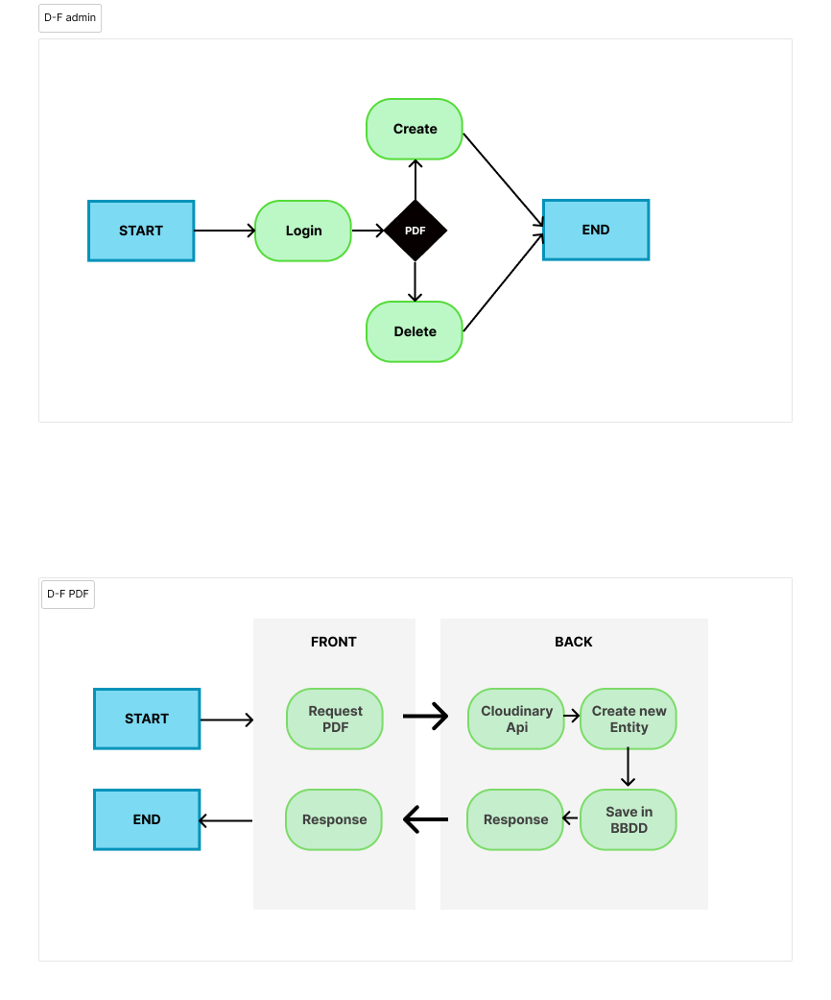
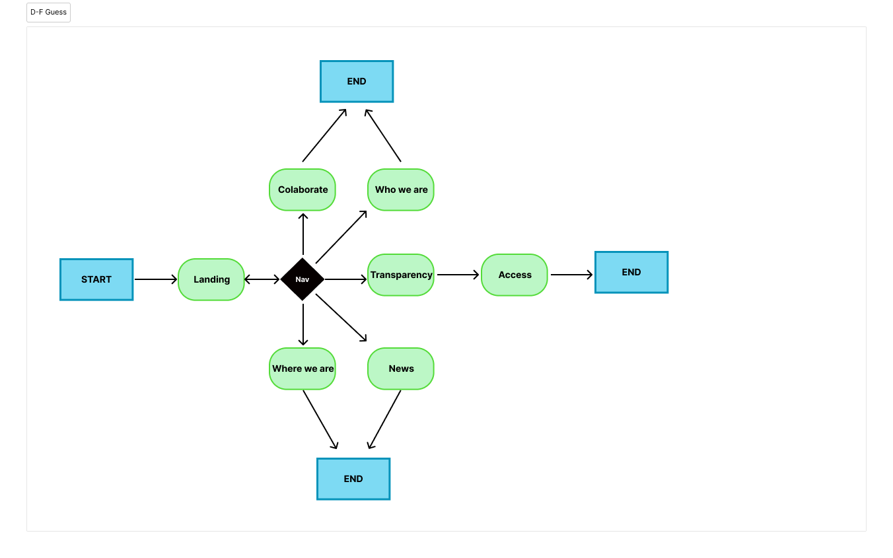
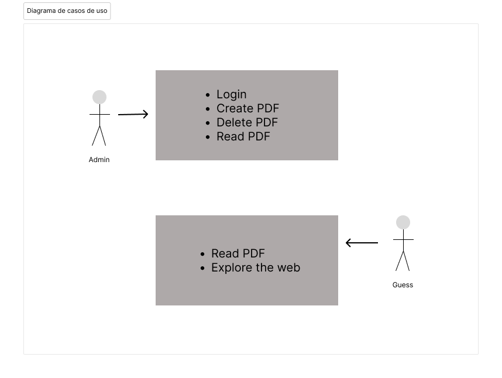
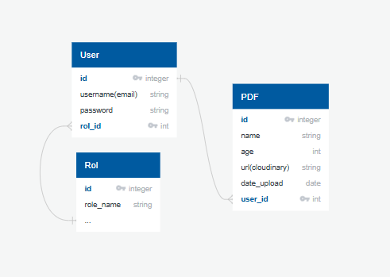
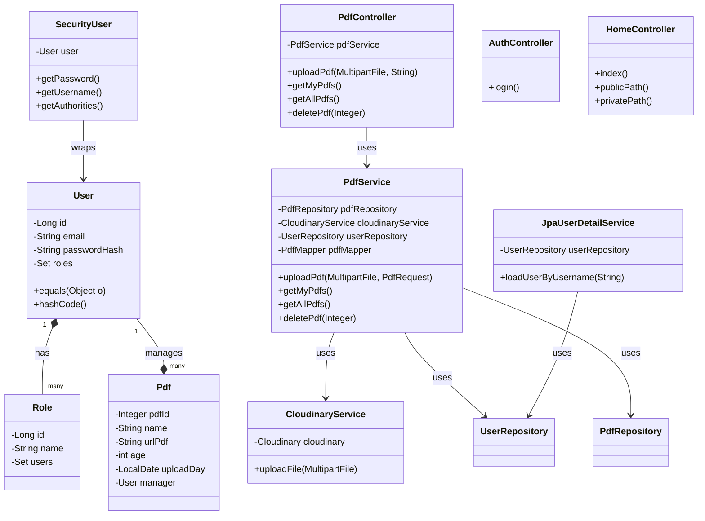

# Calor en la Noche Backend 📄

[](https://www.oracle.com/java/)
[](https://junit.org/junit5/)
[](https://maven.apache.org/)
[](#)

Una API REST desarrollada con Java y Spring Boot para la gestión de documentos PDF.
Incluye funcionalidades de autenticación, autorización, subida y gestión de archivos PDF con almacenamiento en Cloudinary.

## 📋 Descripción

Calor en la Noche Backend es un sistema diseñado para gestionar documentos PDF de manera segura.
Permite manejar la subida, almacenamiento y gestión de PDFs con control de acceso mediante Spring Security y almacenamiento en la nube usando Cloudinary.

## 🚀 Características

- **Gestión de usuarias**: Registro, autenticación y roles (Spring Security).
- **Gestión de usuarios**: Login y autenticación con roles (Spring Security)
- **Subida de PDFs**: Integración con Cloudinary para almacenamiento en la nube
- **Control de acceso**: Autorización basada en roles (USER, ADMIN)
- **API RESTful**: Endpoints documentados con Swagger/OpenAPI
- **Gestión de documentos**: CRUD completo para PDFs
- **Seguridad robusta**: Autenticación basada en sesiones
- **Persistencia de datos**: MySQL para producción, H2 para tests
- **Testing completo**: Tests unitarios e integración

## 🛠️ Tecnologías

- **Java 21**
- **Spring Boot 3.5**
- **Spring Data JPA**
- **Spring Security**
- **Spring Data JPA**
- **Hibernate**
- **MySQL** (configurada via variables de entorno)
- **H2** (Testing)
- **Cloudinary** (Almacenamiento)
- **Swagger/OpenAPI 3** para documentación
- **Lombok** para reducir código boilerplate
- **Bean Validation** para validación de datos
- **JUnit 5** para testing

## 📁 Estructura del Proyecto

```
src/main/java/dev/jesus/calor_en_la_noche/
├── auth/           # Autenticación y login
├── config/         # Configuraciones (security, cloudinary, etc)
├── home/           # Endpoints públicos/privados
├── pdf/            # Gestión de documentos PDF
├── role/           # Gestión de roles
├── security/       # Configuración Spring Security
└── user/          # Gestión de usuarios

```

## 🎯 Endpoints Principales

### 📝 **PDF Controller**

- `POST /api/v1/pdf/upload` → Subir nuevo PDF
- `GET /api/v1/pdf/mine` → Obtener PDFs del usuario
- `GET /api/v1/pdf/all` → Listar todos los PDFs
- `DELETE /api/v1/pdf/{id}` → Eliminar PDF

---

### 🐾 **Patient Controller**

- `GET /api/v1/patients` → Listar todos los pacientes
- `POST /api/v1/patients` → Registrar un nuevo paciente
- `GET /api/v1/patients/{id}` → Obtener un paciente por ID
- `DELETE /api/v1/patients/{id}` → Eliminar un paciente por ID
- `GET /api/v1/patients/owner/{dni}` → Listar pacientes por DNI del dueño

---

### 🔑 **Auth Controller**

- `GET /api/v1/login` → Iniciar sesión

---

### 🏠 **Home Controller**

- `GET /` → Endpoint raíz
- `GET /public` → Endpoint público
- `GET /private` → Endpoint privado (requiere autenticación)

## ⚙️ Configuración

### Configuración de Base de Datos

La aplicación está configurada para:

- MySQL como motor de base de datos
- Crear tablas automáticamente (`create-drop`)
- Poblar con datos de prueba via `data.sql`
- Mostrar consultas SQL en consola

## 🏃 Ejecución

### Requisitos Previos

- Docker
- Docker Compose

### Opción 1: Docker (recomendada)

1. Clona el repositorio:

```bash
git clone https://github.com/jemb4/calor-en-la-noche-backend
```

2. Accede al directorio:

```bash
cd calor-en-la-noche-backend
```

3. Inicia la aplicación:

```bash
docker compose up -d
```

### Opción 2: Ejecución local

Requisitos adicionales:

- Java 21
- Maven

1. Configura las variables de entorno
2. Ejecuta:

```bash
./mvnw spring-boot:run
```

La aplicación estará disponible en `http://localhost:8080`

## 📖 Documentación

Una vez ejecutada la aplicación, accede a:

- **Swagger UI**: `http://localhost:8080/swagger-ui/index.html`
- **OpenAPI JSON**: `http://localhost:8080/v3/api-docs`

## 🧪 Testing

Ejecuta las pruebas:

```bash
mvn test
```

El proyecto incluye:

- Tests unitarios para servicios
- Tests de integración para endpoints
- Tests de entidades

## 🔐 Seguridad

- Autenticación basada en sesiones
- Roles: ADMIN, GUESS
- Encriptación de contraseñas con BCrypt
- CORS configurado para frontend

## 🚀 CI/CD

- Tests automáticos en cada commit
- Build con Maven
- Contenedorización con Docker

## 🐳 Dockerización

### Contenedores

La aplicación está completamente dockerizada y usa los siguientes servicios:

- **app**: Aplicación Spring Boot
- **mysql**: Base de datos MySQL
- **phpmyadmin**: Interfaz web para MySQL (opcional)

### Comandos Docker

1. **Iniciar todos los servicios**:

```bash
docker compose up
```

2. **Iniciar en modo detached**:

```bash
docker compose up -d
```

3. **Detener y eliminar contenedores**:

```bash
docker compose down
```

4. **Detener, eliminar contenedores y volúmenes**:

```bash
docker compose down -v
```

5. **Ver logs de la aplicación**:

```bash
docker compose logs -f app
```

### Puertos expuestos

- **8080**: API Spring Boot
- **3306**: MySQL

### Volúmenes persistentes

- `mysql_data`: Datos de MySQL
- `uploads`: Archivos PDF temporales

Para reconstruir las imágenes después de cambios:

```bash
docker compose build --no-cache
```

La aplicación estará disponible en `http://localhost:8080`

## 📊 Diagramas








**Desarrollado con ❤️ y Spring Boot**.
